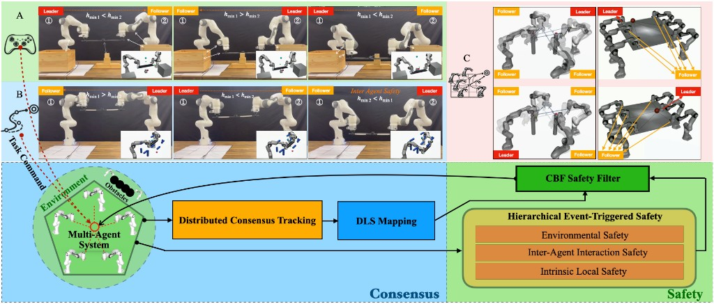
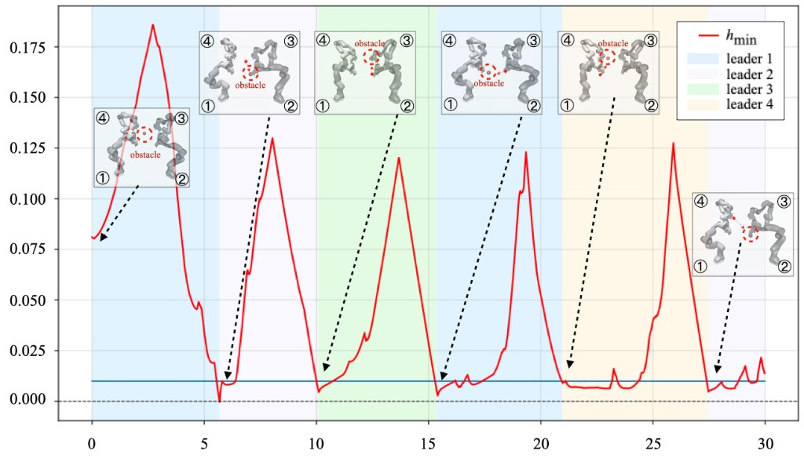
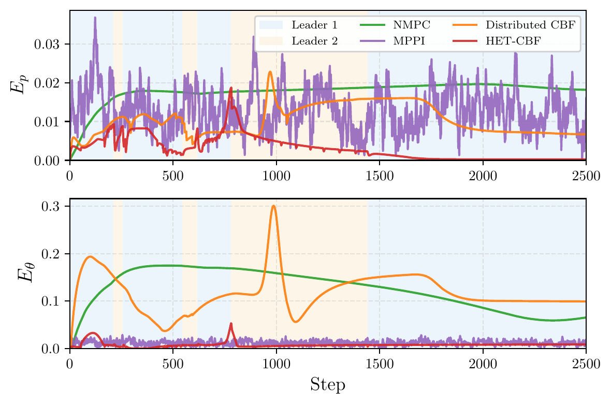
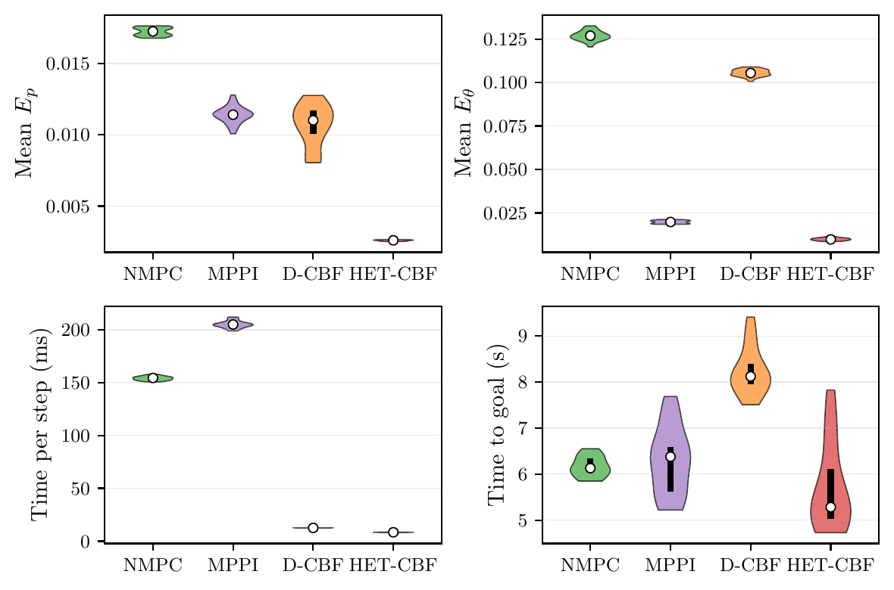

<div align="center">

# [IROS 2026] Safe Consensus of Cooperative Manipulation with Hierarchical Event-Triggered Control Barrier Functions

<p>
  <em>A distributed control framework for safe cooperative manipulation that achieves consensus coordination
  with formal safety guarantees via hierarchical event-triggered control barrier functions (HET-CBF).</em>
</p>

**Simiao Zhuang · Bingkun Huang · [Zewen Yang](mailto:zewen.yang@tum.de)**

Munich Institute of Robotics and Machine Intelligence (MIRMI)<br>
Technical University of Munich (TUM), 80992 Munich, Germany

<p>
  <a href="https://zsmandreas.github.io/Safe-Consensus-with-Hierarchical-ET-CBF/">
    </a>
  &nbsp;
  <a href="https://arxiv.org/pdf/2603.06356">
    </a>
  &nbsp;
  <a href="https://doi.org/10.48550/arXiv.2603.06356">
    </a>
  &nbsp;
  <a href="https://github.com/ZSMandreas/Safe-Consensus-with-Hierarchical-ET-CBF">
    </a>
</p>

<p>
  
  
  
</p>

</div>

---

## Overview

<div align="center">
  
  <br>
  <sub>Overview of the proposed framework. The <code>h_min</code> function encodes the minimum distance between the robot and environmental obstacles.</sub>
</div>

---

## Links

- 🌐 **Project page:** https://zsmandreas.github.io/Safe-Consensus-with-Hierarchical-ET-CBF/
- 📄 **Paper (PDF):** https://arxiv.org/pdf/2603.06356
- 📚 **arXiv:** https://doi.org/10.48550/arXiv.2603.06356
- 💻 **Code:** Coming soon

---

## Abstract

Cooperative transport and manipulation of heavy or bulky payloads by multiple manipulators requires coordinated
formation tracking, while simultaneously enforcing strict safety constraints in varying environments with limited
communication and real-time computation budgets. This paper presents a distributed control framework that achieves
consensus coordination with safety guarantees via **hierarchical event-triggered control barrier functions (CBFs)**.

We first develop a consensus-based protocol that relies solely on local neighbor information to enforce both
translational and rotational consistency in task space. Building on this coordination layer, we propose a
three-level hierarchical event-triggered safety architecture with CBFs, integrated with a risk-aware leader
selection and smooth switching strategy to reduce online computation. The approach is validated through real-world
hardware experiments using two Franka manipulators with static obstacles, and comprehensive simulations
demonstrating scalable multi-arm cooperation with dynamic obstacles. Results show higher-precision cooperation
under strict safety constraints, with substantially reduced computational cost and communication frequency
compared to baseline methods.

---

## Key Contributions

| | Contribution | Description |
|:---:|:---|:---|
| 🔗 | **Distributed Consensus Tracking** | A fully distributed consensus-tracking protocol using only local neighbor information to enforce both *translational* and *rotational* consistency in task space. Feedback linearization converts the nonlinear manipulator dynamics into a task-space double integrator, enabling scalable cooperation under closed-chain coupling. |
| 🧱 | **Hierarchical Event-Triggered Safety** | A three-level event-triggered CBF architecture (environmental, inter-agent, and intrinsic local safety) with risk-aware leader selection and smooth switching that activates safety constraints only when needed, reducing online QP computation and communication overhead. |
| 🧪 | **Real-World & Simulation Validation** | Validated on two Franka Emika Panda arms with static obstacles, and through extensive MuJoCo Monte Carlo studies and four-arm scenarios with dynamic obstacles, demonstrating scalability, robustness, and superior performance over baselines. |

---

## Results

### Multi-Arm Safety under a Dynamic Obstacle

<div align="center">
  
</div>

In the four-arm scenario, a single dynamic spherical obstacle circles the formation, repeatedly shifting risk among
arms and producing periodic drops in the minimum safety barrier `h_min(t)`. The active leader always rotates to the
arm closest to the obstacle, keeping `h_min(t) > 0` throughout the entire execution and guaranteeing collision-free
cooperation.

### Formation Consensus Errors vs. Baselines

<div align="center">
  
</div>

HET-CBF consistently achieves the smallest position error `E_p` and the lowest orientation error `E_θ` overall, while
NMPC settles at a larger steady-state error, MPPI oscillates, and the Distributed CBF degrades over time.

### Monte Carlo Evaluation (20 Trials)

<div align="center">
  
</div>

Across randomized trials, HET-CBF attains the lowest tracking errors and the smallest per-step solve time.

### Four-Arm Quantitative Comparison

| Method | Safety | Time / step (ms) | `E_p` | `E_θ` |
|:---|:---:|:---:|:---:|:---:|
| **Ours (HET-CBF)** | ✅ | **3.06 ± 0.51** | **0.0080 ± 0.0092** | **0.030 ± 0.072** |
| D-CBF | ✅ | 3.32 ± 0.37 | 0.011 ± 0.0068 | 0.039 ± 0.086 |
| NMPC | ❌ | 42.03 ± 7.56 | 0.036 ± 0.014 | 0.13 ± 0.090 |
| MPPI | ❌ | 259.2 ± 13.90 | 0.010 ± 0.0092 | 0.047 ± 0.062 |

> Only **Ours** and **D-CBF** satisfy safety constraints throughout the task. Ours attains the lowest per-step solve
> time and the best formation accuracy (`E_p`: position error, `E_θ`: orientation error).

---

## Citation

If you find this work useful, please consider citing:

```bibtex
@inproceedings{Zhuang_IROS_2026_SafeConsensus,
  title     = {Safe Consensus of Cooperative Manipulation with Hierarchical
               Event-Triggered Control Barrier Functions},
  author    = {Zhuang, Simiao and Huang, Bingkun and Yang, Zewen},
  booktitle = {2026 IEEE/RSJ International Conference on Intelligent Robots and Systems (IROS)},
  year      = {2026}
}
```

---

<div align="center">
  <sub>Munich Institute of Robotics and Machine Intelligence (MIRMI) · Technical University of Munich</sub>
</div>
